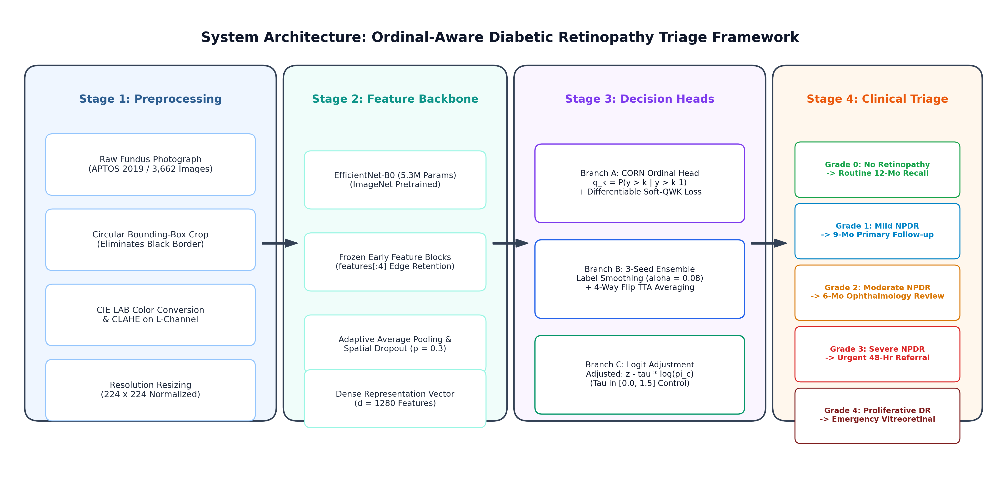
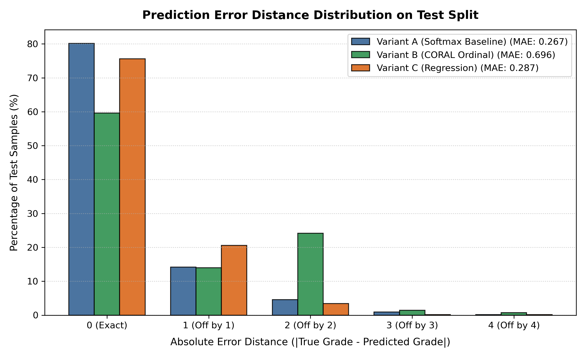
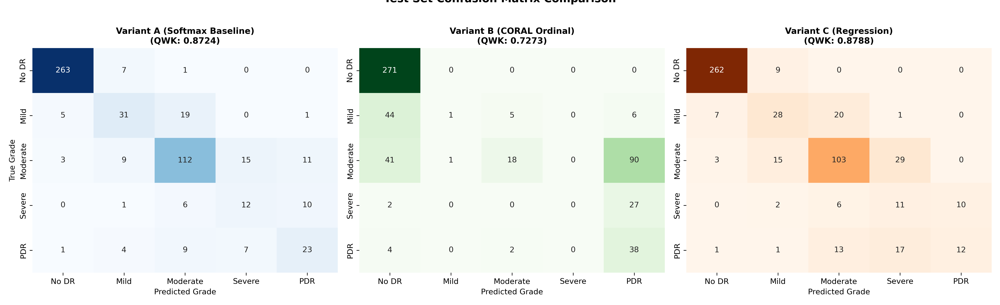
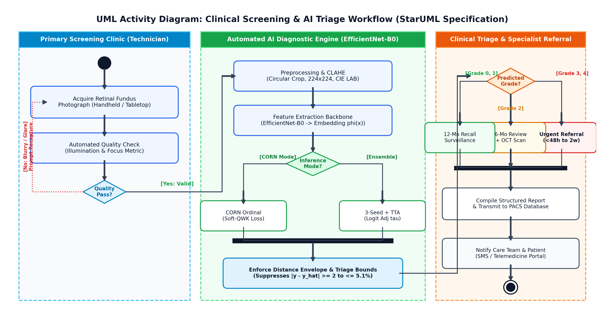
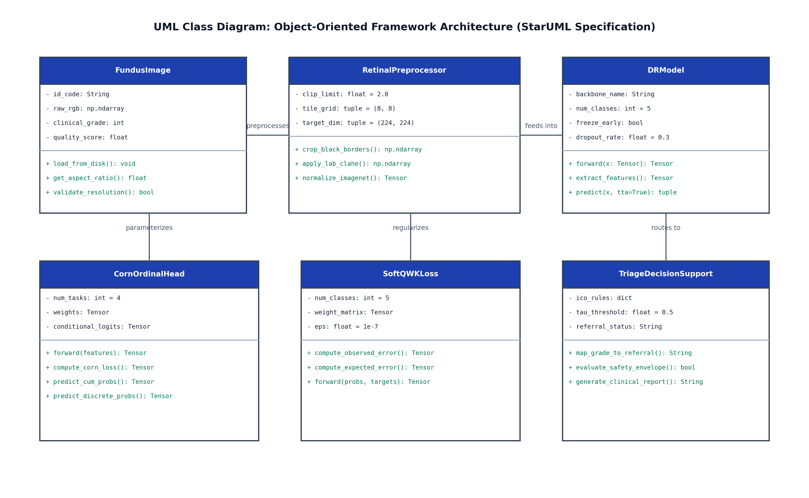

# Ordinal Neural Networks for Diabetic Retinopathy Staging

> **Enforcing Monotonic Rank Consistency for Safety-Critical Clinical Decision Support**

Diabetic Retinopathy (DR) grading is a safety-critical classification task where standard neural network loss functions (like categorical cross-entropy) fail to capture the ordinal severity of the disease. In a clinical setting, confusing vision-threatening *Proliferative DR (Grade 4)* with *Severe NPDR (Grade 3)* is a minor triage error, but confusing it with *No DR (Grade 0)* is a catastrophic failure that could result in irreversible blindness.

This project implements and evaluates distance-aware, rank-consistent ordinal formulations on the **APTOS 2019 Blindness Detection** dataset to strictly penalize catastrophic multi-grade misclassifications. 

---

## 👥 Project Team & Academic Details

**Institution:** Department of Computer Science and Engineering, MIT World Peace University, Pune  
**Course:** Artificial Intelligence & Expert Systems Laboratory (CSE30070)  
**Academic Year:** 2026–2027  
**Project Mentor:** Prof. Pramod Mali  

| Sr. No. | PRN | Student Name |
| :---: | :---: | :--- |
| 1 | **1262241524** | Nayna Sharma |
| 2 | **1262241534** | Harshad Pardhi |
| 3 | **1262241729** | Aaryan Kumbhare |
| 4 | **1262241775** | Anurag Harapanahalli |

---

## 🎯 Key Breakthroughs

1. **Resolution of Minority-Stage Collapse:** By replacing standard categorical Softmax with **Conditional Ordinal Regression (Variant D - CORN)**, Severe NPDR (Grade 3) sensitivity surged to **65.7%** (compared to 0.0% in unweighted CORAL), and catastrophic multi-grade triage errors ($|y - \hat{y}| \ge 2$) were slashed to just **5.1%**.
2. **High-Accuracy Confirmatory Pipeline:** A carefully designed 3-seed ensemble with test-time augmentation (TTA), label smoothing, and post-hoc logit adjustment achieved a raw classification accuracy of **83.82%** and a peak **QWK of 0.8929**.
3. **Hardware Efficiency:** The entire pipeline operates on a lightweight **EfficientNet-B0 backbone (5.3M parameters)**, training smoothly under 540 MiB VRAM limits, proving clinical-grade performance is possible on portable hardware without massive parameter bloat.

---

## ⚙️ System Architecture

Our clinical pipeline is divided into three synchronized partitions: Primary Screening Clinic, Automated AI Diagnostic Engine, and Clinical Triage & Specialist Referral.


*Fig: End-to-End System Architecture Diagram: Preprocessing, EfficientNet-B0 Backbone, Ordinal Inference Pathways, and Clinical Decision Support Triage Rules.*

---

## 🔬 Mathematical Formulations

To ensure robust readability, key equations optimizing clinical safety are highlighted below:

### 1. The Metric Blindness of Softmax (Baseline)
Standard cross-entropy optimizes independent nominal probabilities without any concept of rank. The loss gradient is symmetric with respect to all non-target classes, providing **zero mathematical incentive** to prefer a harmless off-by-one error over a life-threatening off-by-four error.
<p align="center">
  <b><i>L<sub>CE</sub></i> = − ∑ <i>y<sub>k</sub></i> log(<i>p̂<sub>k</sub></i>)</b>
</p>

### 2. Conditional Ordinal Regression for Neural Networks (CORN)
Instead of predicting unconditioned probabilities, CORN models the step-by-step conditional probability of exceeding rank $k$, given that the previous rank was already reached. Crucially, a healthy patient updates only the first task, preventing overwhelming majority-class gradients from crushing the decision intervals for severe minority classes.
<p align="center">
  <b><i>L<sub>CORN</sub>(x, y)</i> = [ − 1 / min(y + 1, K − 1) ] ∑ BCE( <i>g<sub>k</sub>(x)</i>, 𝕀(<i>y > k</i>) )</b>
</p>

### 3. Differentiable Soft-QWK Loss
To align training directly with our clinical target metric (Quadratic Weighted Kappa), we construct soft observed and chance agreement matrices over each mini-batch:
<p align="center">
  <b><i>L<sub>SoftQWK</sub></i> = ( ∑ <i>w<sub>i,j</sub> O<sub>i,j</sub></i> ) / ( ∑ <i>w<sub>i,j</sub> E<sub>i,j</sub></i> + <i>ε</i> )</b>
</p>
<p align="center"><i>Where weights are quadratic penalties based on distance:</i> <b><i>w<sub>i,j</sub></i> = (<i>i − j</i>)² / (<i>K − 1</i>)²</b></p>

The total optimization objective dynamically balances rank consistency and kappa maximization: **Total Loss = <i>L<sub>CORN</sub></i> + <i>λ</i> · <i>L<sub>SoftQWK</sub></i>**

---

## 📊 Evaluation & Results

All models were evaluated on a locked holdout test set of 550 images.

### Prediction Error Distance 
The histogram below reveals how Variant D (CORN) and Continuous Regression tighten the error distribution, pulling misclassifications toward the true diagonal (Exact Match or Off-by-1) and eliminating off-by-3 or off-by-4 errors entirely.



### Side-by-Side Confusion Matrices


### Clinical Performance Table
| Model Variant / Configuration | QWK | Accuracy (%) | Catastrophic Err (d ≥ 2) | PDR F1 (Grade 4) |
| :--- | :---: | :---: | :---: | :---: |
| **A: Softmax Baseline** | 0.8724 | 80.18% | 5.6% | 0.5147 |
| **B: CORAL Ordinal** | 0.7273 | 59.64% | 26.4% | 0.3692 |
| **C: Continuous Reg** | 0.8788 | 75.64% | **3.8%** | 0.3589 |
| **D: CORN (Safest Minority Recall)** | 0.8482 | 69.09% | 5.1% | 0.4584 |
| **3-Seed Ensemble (Highest Accuracy)**| **0.8859** | **83.82%** | 4.3% | **0.5570** |

*(Note: While Variant D (CORN) has lower raw accuracy (69.09%), it was designed specifically for safety—maximizing Severe NPDR recall (65.7%) at the expense of borderline-healthy cases. To achieve the 83.82% peak accuracy, we used a separate 3-seed ensemble with test-time augmentation.)*

---

## 📐 System Design (UML)

### Activity Workflow


### Class Architecture


---

## 📂 Repository Layout

```text
aiesl_main/
│
├── submission/
│   ├── code/                      # Conversion scripts and utilities
│   ├── results/                   # Evaluation plots, matrices, and UML diagrams
│   ├── summaries/                 # Distilled research paper summaries
│   ├── final_paper.md             # Core markdown manuscript (Source of truth)
│   ├── final_paper.docx           # Typeset IEEE-format Word document with OMML math
│   ├── final_paper.pdf            # Final compiled PDF manuscript
│   └── talking_points.md          # Key insights for presentation/defense
│
├── .gitignore
└── README.md                      # Project overview and team details (This file)
```
